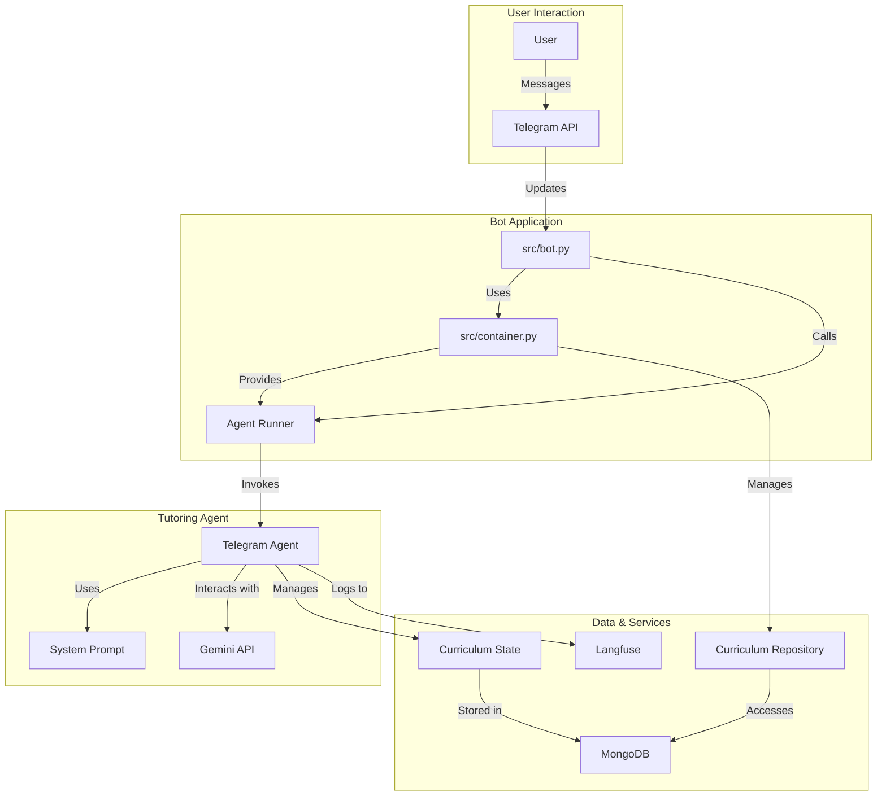

# Data Science Tutor Telegram Bot

This project is a Telegram bot that acts as a friendly and engaging data science tutor for students aged 11-13. The bot
uses a curriculum-based approach to guide students through various data science concepts, tracks their progress, and
adapts to their learning pace.

## Features

- **Interactive Tutoring:** Engages students in a conversational manner using a ReAct (Reasoning and Acting) loop.
- **Curriculum-Based Learning:** Follows a structured curriculum covering fundamental data science topics.
- **Progress Tracking:** Monitors student's mastery level, struggles, and interests to provide a personalized learning
  experience.
- **Telegram Integration:** Interacts with students through the Telegram messaging platform.
- **Extensible:** Built with a modular architecture using dependency injection, making it easy to extend and add new
  features.

## Getting Started

These instructions will get you a copy of the project up and running on your local machine for development and testing
purposes.

### Prerequisites

- Python 3.10+
- MongoDB
- A Telegram Bot Token

### Installation

1. **Clone the repository:**

   ```bash
   git clone https://your-repository-url.com/
   cd tutor
   ```

2. **Create a virtual environment and activate it:**

   ```bash
   python -m venv venv
   source venv/bin/activate  # On Windows use `venv\Scripts\activate`
   ```

3. **Install the dependencies:**

   ```bash
   pip install -r requirements.txt
   ```

4. **Set up the environment variables:**

   Create a `.env` file in the root directory of the project and add the following variables:

   ```env
   TELEGRAM_BOT_TOKEN="your_telegram_bot_token"
   GEMINI_API_KEY="your_gemini_api_key"
   DB_PATH="path_to_your_database.db"
   MONGODB_URI="your_mongodb_connection_string"
   MONGODB_DATABASE="your_mongodb_database_name"
   LANGFUSE_BASE_URL="https://cloud.langfuse.com"
   LANGFUSE_SECRET_KEY="your_langfuse_secret_key"
   LANGFUSE_PUBLIC_KEY="your_langfuse_public_key"
   ```

### Usage

To start the bot, run the following command from the root directory of the project:

```bash
python -m src.bot
```

## Project Structure

The project follows a modular structure, with a clear separation of concerns.

```
.
├── src
│   ├── agents
│   │   ├── telegram_agent
│   │   │   ├── data
│   │   │   │   └── empty_curriculum.json
│   │   │   ├── prompts
│   │   │   │   └── system_prompt.md
│   │   │   └── tools
│   ├── domain
│   ├── infrastructure
│   ├── bot.py
│   └── container.py
├── tests
└── pyproject.toml
```

## Key Components

- **`src/bot.py`:** The main entry point of the application. It initializes the Telegram bot, sets up handlers, and
  starts the polling loop.
- **`src/container.py`:** Configures the dependency injection container, which manages the application's components and
  their dependencies.
- **`src/agents/telegram_agent/`:** Contains the core logic for the tutoring agent, including its prompts, tools, and
  data structures.
- **`src/agents/telegram_agent/prompts/system_prompt.md`:** Defines the persona and behavior of the AI tutor.
- **`src/agents/telegram_agent/data/empty_curriculum.json`:**  The data structure for the data science curriculum.
- **`src/domain/`:**  Contains the domain models of the application.
- **`src/infrastructure/`:**  Contains the implementation of services that interact with external systems, such as
  databases and APIs.

## Architecture

The following diagram illustrates the high-level architecture of the application:



## Dependencies

The project's key dependencies are listed in the `pyproject.toml` file.

- **`google-adk`**: The Google Agent Development Kit for building AI agents.
- **`injector`**: A dependency injection framework for Python.
- **`pymongo`**: The Python driver for MongoDB.
- **`python-telegram-bot`**: A library for interacting with the Telegram Bot API.
- **`langfuse`**: A tool for tracing and debugging LLM applications.

## Contributing

Pull requests are welcome. For major changes, please open an issue first to discuss what you would like to change.
